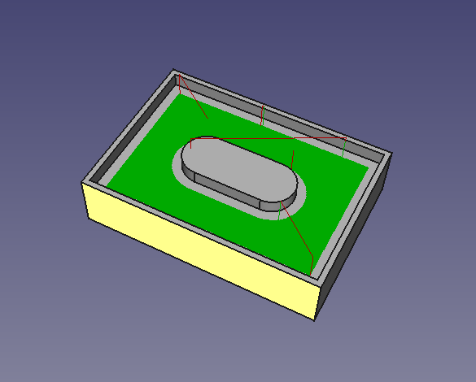

# A set of tutorials around foss*1 tools for the mpcnc*2
*1) free and open source 
*2) [mostly printed cnc](https://www.v1engineering.com/specifications/)

The related discussion can be found in the [forum](https://www.v1engineering.com/forum/topic/foss-milling-toolchain-freecad-gbrl-on-ramps-discussion/) 

**WARNING**
 
I’m no expert in all of this. Try at your own risk!

*This is work in progress and will be extended bit by bit.*

## Overview of tutorials

|Nr. | Title | Description      |
| :------------- | :------------- |:-------------|
|1| [Freecad part 1](freecad_1.html) | From *zero* &rarr; gcode; Get FreeCAD, design a pocket with island, export gcode|
|2| [Controller board, firmware](firmware_1.html)  | Controller board & firmware options |
|3| [ZOOM: controller & firmware option B) ](zoom_1.html) | grbl on ramps for dual end stop based auto squaring |
|4| [bCnC](bcnc_1.html) | Get, configure and get started with [bCNC](https://github.com/vlachoudis/bCNC) |
|5| [Milling part 1](mill_1.html) **NEW**| Milling the part from tutorial 1|
|6| [Extending part 1](mill_1.html) **NEW**| Configuring to sensible settings, adding finish pass and holding tags| 

## Motivation
I really like open source stuff, and I’m quite impressed by [Ryan](https://www.v1engineering.com/members/vicious1/) & folks. I have build my own mpcnc and want to contribute my part to the [V1 universe](https://www.v1engineering.com/).

I think the open design & open source approach is quite powerful; I dislike to depend on closed source software which does not natively run on my favorite operating system (linux).

I think paying license fee for CAM software is OK, because providing such a software is much work.
For me, I decided against it for several reasons.

Due to the complexity of the matter for newcomers, default tools are typically not replaced by standard users. Although there are a bunch of people operating the mpcnc & related machines with foss, and great solutions out there (see the tutorials below touching some of them), it took me several hours of reading, testing and playing around to combine the various bits of information to a consistent solution for me.  

*Therefore I decided to provide an easy to follow, step by step guide to a foss toolchain for the mpcnc, with the aim to be applicable using linux, windows and macos.
I hope you can follow all of this; if not, feel free to ask in the [related thread](https://www.v1engineering.com/forum/topic/foss-milling-toolchain-freecad-gbrl-on-ramps-discussion/).*

A bold **thank you** goes out to Ryan and all the other people (e.g. from FreeCAD, debian, grbl, bCNC) out there, for sharing their expertise with us! 

## The goal
Get generated gbrl gcode ‘from zero’ using Freecad (get it, do the design, path generation, gcode export) for the shown geometry.

It has the features: pocket with island and finish allowance which I think shows most of the necassary basics. We will later add more complex stuff (see the to do list).

