# Why script based modelling

I like script based, parametric modelling, because I can 'replay' complex design sequences with adapted parameters.

Examples are my kite-hydrofoil and SUP hydrofoil front and rear wings, which follow the same design approach, with the rear wing being a smaller version of the front wing and the SUP/Wave front wing (I call it *monster*) having a 3 x chordlength.

<br>
##Kite & SUP foils

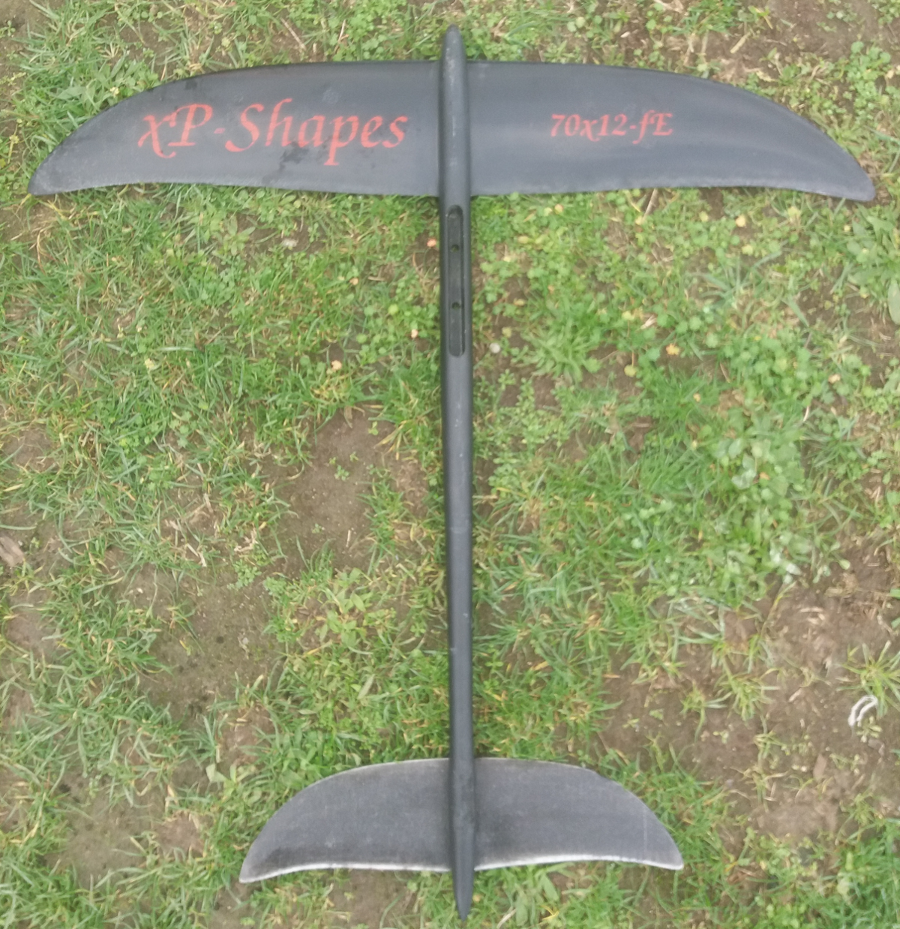

<br><br>
**Sup/Wave foil *monster* wing**

Wonder why it look that way? Pretty easy: I use it with kite and with my SUP (withe paddle) in waves.
When I was waching SUP wave videos form others (in the early days) I saw that they need to palle like crazy to get flying, get flying late, wenh the wave is already steep, then race down the slope and get far in front of the wave. In addition, I wanted to be as agile (tight curves) as with my kite-foil

My design conditions therefore have been:

- keep the width at 70cm only (today typical SUP foils use 90cm or even larger!)
- get to fly at ~12km/h to catch the wave early before it gest to steep
- limit the max velocity via slef-limitation

all in all, using a low aspect ratio (large chord relative to given spanwidth) and generating massive induced drag did the job and I'm quite pleased with the result.

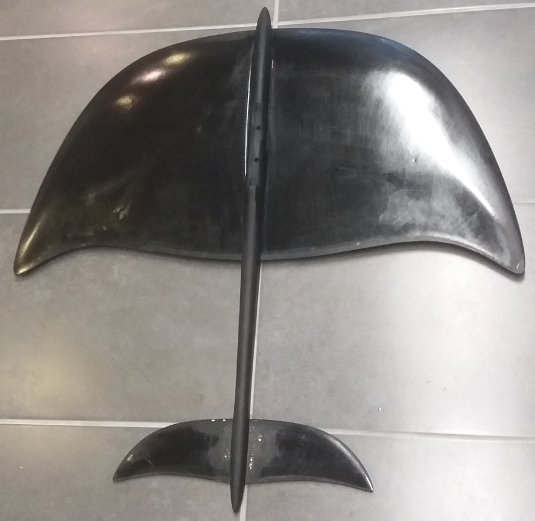


<br>
##The basic scripts
I provide my scripts at [github](https://github.com/alexpGH/blenderCadCamTools).
The folder *scripts* contains wingLib.py, the library holding the basic worker routines and 2D airfoil data

|Folder|Name|Comment|
|------|:------:|------|
|scripts|wingLib.py|basic worker routines to e.g. get from 2D points to 3D surfaces|
|scripts|afData_xy.py|2D airfoil data for profile *xy* |
|planes/basicWing|basicWing.blend|the blender file for the basic wing example|
|planes/basicWing|ellipticPlaneWing.py|the python script used in the basicWing.blend file to generate a planar wing with elliptic chord|

I currently include the *h105* profile, which I (and many others) use for hydrofoils.
This will be extended bit by bit according to my needs.
Feel free to add your own profile data and send me a pull request.
If you are looking for a specific dataset, check out [UIUC Airfoil Database](https://m-selig.ae.illinois.edu/ads/coord_database.html).

<br>
## Getting started
<a name="gettingStarted"></a>
**What we'll be doing:**

1. Take a set of points for a  2d profile (in this case the h105)
1. Determine the position of the leading edge according to a parametrized curve (to achieve the seewp back of the wing tip region)
1. Determine the chordlength along the span according to an elliptic curve
1. Scale and place the 2D points and fit a curve through them (we then have a set of 2D profile curves placed in 3d as wing sections)
1. Fit a surface through all the curves 

This gives us the 3D wing

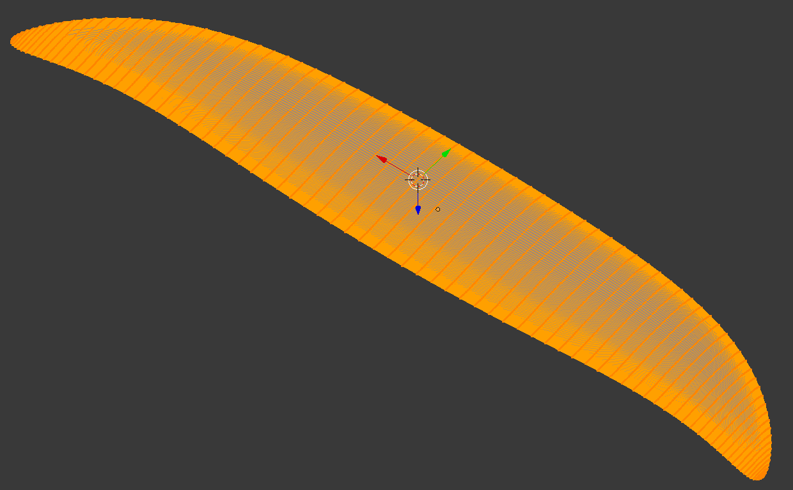

which could then be used for generating CAM paths using blenderCam.

<br>
**Open blender's scripting workspace**
<br>Once you have blender up and running, clone the [blenderCadCamTools](https://github.com/alexpGH/blenderCadCamTools).
<br>Start blender and open the basicWing.blend file.  
The reult should look like: 
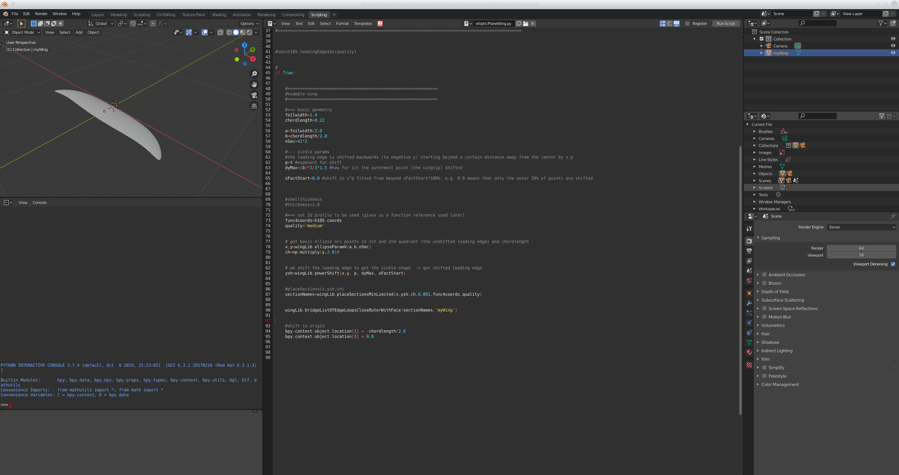

If not, check to be on the *scripting workspace* - you can select the different workspace in the top menu to the right of the standard menue (File, ...).
You will most probaly end-up switching between *Modeling* and *Scripting*.

In the *Scripting* workspace, the script *ellipticPlaneWing.py* from the repo (stored right next to the blend file) should be open.
<br>If not, click the symbol which looks like a folder (second from right), browse to where you cloned the repo to and open planes/basicWing/ellipticPlaneWing.py 

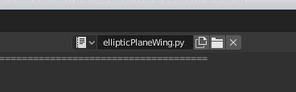


<br>
## Scripting tools
On the left side, you have the

- usual modeling wintow (top)
- python console (middle) where you can enter python commands
- python commands blender uses when you model (using the mouse and user interface). This is quite helful, as you can copy paste the commands over to your scripts  

Now click in the modeling window (top left) and hit **n** to pu-up the *item transform dialogue* which shows the location properties of the selected object (the wing). 

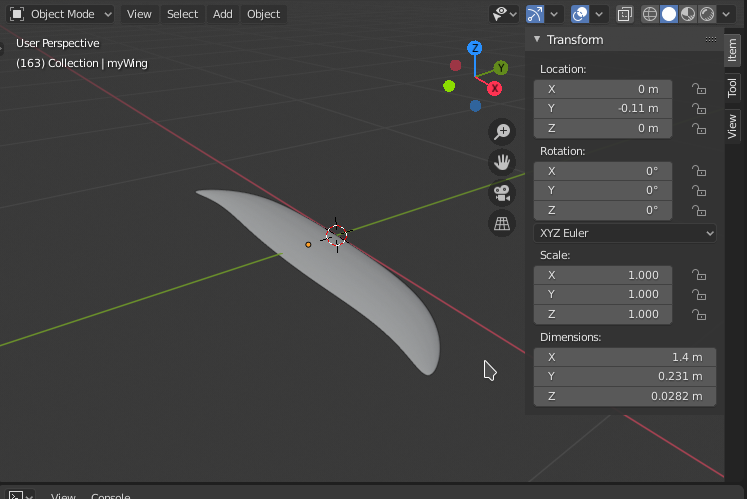

In the field for *Location Y* enter **0** and hit enter.
The script output window (left bottom shows the python api used to set the Y location).
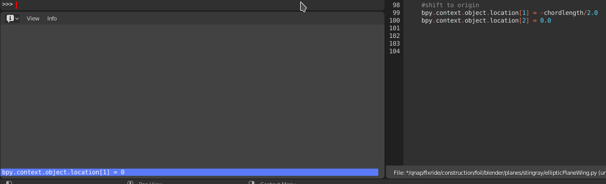
Select via left-click (blue), right-click>copy and paste in the python console (left middle).
<br>Change '= 0' to e.g. **= 0.042** and hit enter.
<br>The wing now moved to that position:
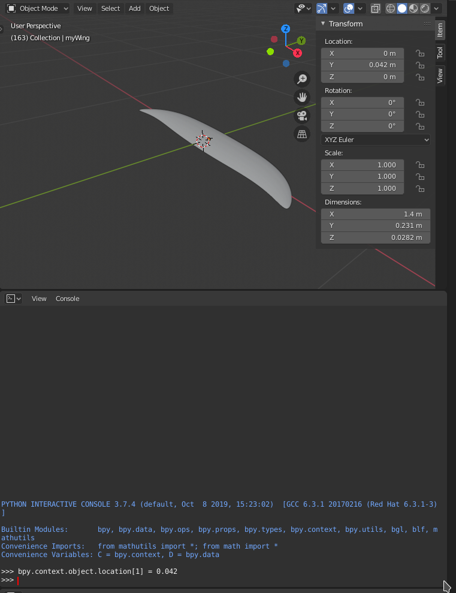
This is what we use at the end of the script (line 99) to place the wing at the origin (previous figure on the right).
<br>**Take home**: what you can model can be scripted. Just open the scripting workspace and have a look at the api command output.


<br>
##The ellipticPlaneWing.py script
The first few lines import necessary libraries, then extend the path to include the blenderCadCam scripts directory.
Line 10 uses a relative path (relative to the current blend file). If you cloned the repo, the scripts directory is 2 dirs up from basicWing.blend.
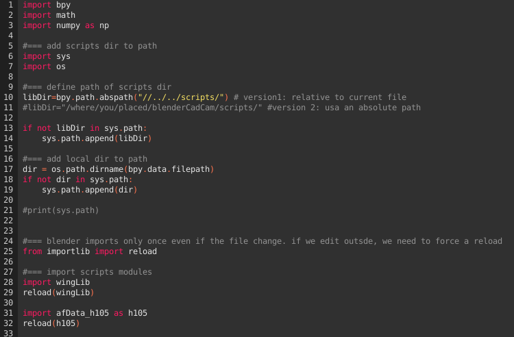
Line 28 & 29 then imports / reloads the winLib (the reload is necessary in case the file changed during the blender session).
<br>Line 31/32 imports the h105 2d profile.

Configure the if clause line 43 to **1**, 50 and 94 to **0**
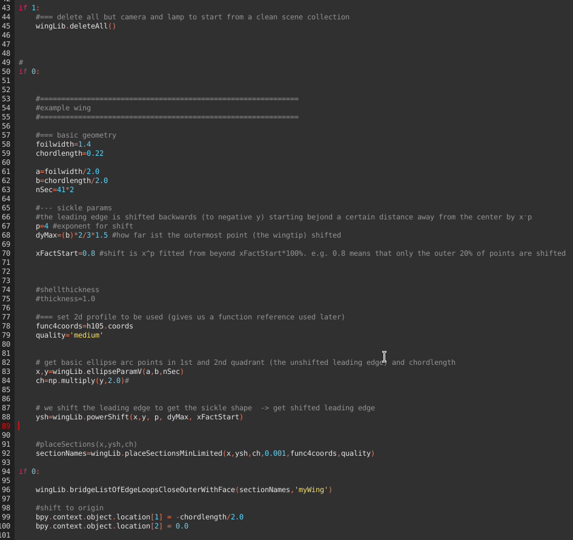
Hit *run script* (upper right of the script window). Noe the wing should have been disappeared. The deleteAll() helper routine in fact deletes all except the camera and lamp.

Configure the if clause line 43 AND 50 to **1**, 94 to **0**. Run the script.
<br>You should now have a set of 2D profiles, named *2dsection_x*.
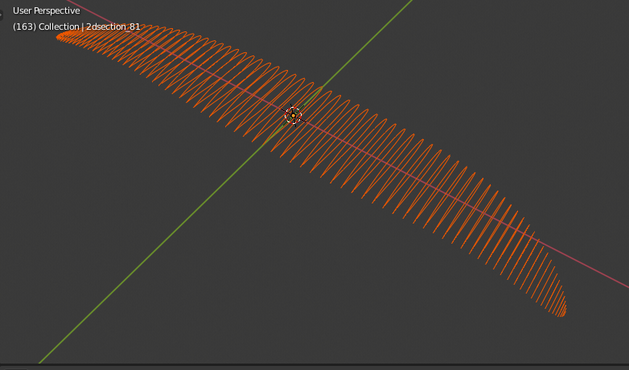
This is the result of executing steps 1.) to 4.) from [some](#gettingStarted)

Configure the if clause line 43, 50 AND 94 to **1**. Run the script. This should give you the result of step 5: a surface fitted through the 2d curves.

Read through the scripts, it should be pretty obvious.
An important hint: the sufaces need to be closed, otherwize you will get weird errors later on (mainly when using boolean intersections for designing moulds etc.). This is done in two places:

1. Each of the 2D curves are closed (in placeSectionsMinLimited calling curveBezierFromPoints(hCoord,name,True) True=closed curve)
2. In bridgeListOfEdgeLoopsCloseOuterWithFace (as the name states: outer edge loop is closed with face))

Getting there took me quite some time fiddling around. It's like always: once you have it, it looks straight forward.
<br>You can now imagine how to generate bend-up wing tips etc. Either use the usual modeling tools of blender to do it once. Alternatively, define a function and adapt z location and y rotation of the individual sections before fitting the surface.

Moulds can now be designed by subtracting the wing from cubes etc. Play a bit with the modeling interface, have a look at the api command output and start designing your own scripts.


<br>
##Adding a new 2D profile
<span style="color:green">**Update:**</span>
The following works as described. Hwoever,in the meantime I added the possibility to directly import dat files ```wingLib.foilImport()```, resampling ```wingLib.foildDataReduceToNpoints()``` and re-sampling for morphing of profiles ```wingLib.interpolateBezier2on1()```. See e.g. kissSlopeWing2.py discussed [below](#more-complex-wing-design).

The follwing sequence can be used to add a new 2D profile, e.g. from [the airfoil database](http://airfoiltools.com/search/airfoils?m=a). We will be doing this for the modified MH30.

**a) Prepare the py file**
<br>Add a new airfoild data file in the scrpts directory, e.g. afData_mh30ModPK.py

**b) Get data in selig format**
<br>Get the data in *selig* format (data starts at the trailing edge, goes the over the upper half to the leading edge and back again on the lower half). The airfoiltools site provides the selig format dat file.

**c) Store the data as python 3D array**
<br>In the afData_mh30ModPK.py, in the function coords, add the profile data for quality *super*, as vector, with x all 0.0

```
def coords(quality,scale,shiftV):
    if(quality=='super'):
     coords=scale*np.array([
       	[0.0,-1.000019, 0.000581],
       	...
       	[0.0, -0.875281,-0.0048557]])+shiftV
```

**d) Open a blend file and helper script**
<br>Take a look at *planes/kissSlope/howtoAddMH30.py* for the python code related to the follwoing steps. You can e.g. open  *planes/kissSlope/kissSlopwWing.blend* and enter the scripting workspace. I included the howtoAddMH30.py there.

**e) Generate dataseta with reduced number of points**
<br>In *howtoAddMH30.py*, after the default header, activate the block *reduce quality*.
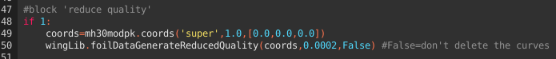
Line 49 provides the *super* coordinates (unscaled and unshifted) and plugs it into a routine (line 50), which reduces the number of points while keeping the error below a certain value. Try e.g. 0.0002 to reduce the 200 datapoints of the MH30 super set to ~60.
<br> Keep the last parameter to *False*, such that you can see the curves *testcurve* and *Simple_testcurve* after running the script.
<br><br>Run the sript.
<br>Inspect the curve *Simple_testcurve* - this is the one with reduced number of points against *testcurve*.
<br>The following image shows only super-small differences (where the orange sections appear).
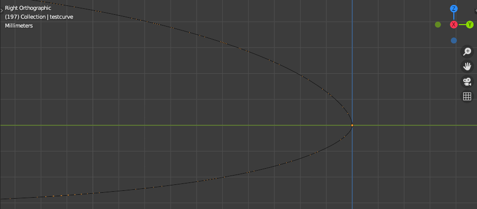
<br><br>Don't be irritated by the fact that the simplified curve is not yet closed at the trailing edge:
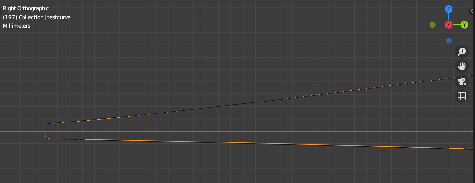

<br><br>Inspect blenders stdout for the reduced dataset in 3d array style and info about the number of points and leading edge index:

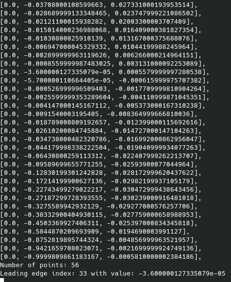
<br>
<br>**Update afData_mh30ModPK.py**
<br>56 Points is good for *full* quality -> copy over the dataset into afData_mh30ModPK.py 
```
elif(quality=='full'):
	coords=scale*np.array([
	...
```
and update the leading edge idx definition for this quality:
```
def leadingEdgeIdx(quality):
    ...
    elif(quality=='full'):
        idx=33
    ...
```

<br>
<br>**Check the result**
<br>Activate the block *Check result*. L55 fetches the data for the generated quality (*full* in our current example) and l.56 fits a Beziercurve as we will do when generating 3D wings.
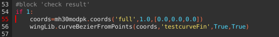
<br> The two boolean *True* parameters refer to: close the curve, and generate a sharp edge where the curve is closed (the trailing edge). 
<br>Run the srcipt & inspect the resulting curve *estcurveFin*.

If it looks good, continue wit *medium* and *low* quality (I used 0.0004 and 0.0008, respectively).


<br>
##More complex wing design
We'll be using the following files:

|Folder|Name|Comment|
|------|:------|------|
|scripts|wingLib.py|basic worker routines to e.g. get from 2D points to 3D surfaces|
|planes/kissSlope|kissSlopeWing.blend|the blender file|
|planes/kissSlope|kissSlopeWing2.py|the python script used to generate a wing with configurable deviation from elliptic chord, multiple profiles and twist angle|

<br>**kissSlope2.py**
<br><br>The header and geometric definition is as usual (L 1-60).
<br><br>We now have the possibility to import profile dat files e.g. applied in l. 66 providing the coordinate matrix and leading edge index.
<br><br>```wingLib.foilDataReducetoNpoints()``` in l.81 allows to downsample the profile data (typically, for CAM model we don't ned as much points as e.g. for aerodynamic analysis). The downsampling reduces points such that the resulting qulaity of the curve is best conserved.
<br><br>```wingLib.interpolateBezier2on1()``` in l.91 interpolates the second curve at the (angular) support points of the first profile. This is required for profile morphing (fading from one profile to another in spanwise direction), as this requires the same number of support points in similar angular distribution.
In this example, we use the AG25 as root profile, then fade over to AG25 and AG14 in the outer region.
<br><br>L.96ff illustrates how to plot the profiles for an inspecton (you should to this to ensure that downsampleing etc. worked out well).
<br><br>L.111 compiles a dict for easy access of the prepared profile data

[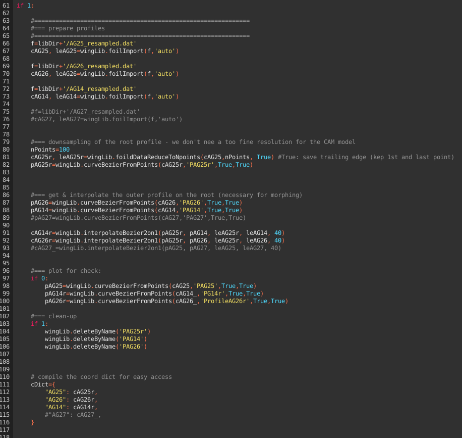](./assets/images/blenderScript9.png)

<a name="basesectiondef"></a>L.123 - 128 defines the base sections: AG25 from span 0-5%, AG26 at 40% span, AG14 from 95% span. tA is the local twist angle. In ths subsections between two basic sections, the twist angle is linear interpolated betwenn the inner and outer basic section settings.
```"tMorph":True``` activates profile morphing for the subsections. Options (currenly) are *lS* and *lCh*. lS linearly morphes the profile according to the relative span position of the subsection between the basic sections (e.g. a subsection right between two base sections would be 50% left and 50% right profile).
*lCh* morphes the profile linear according to the local chordlength compared to the chordlength of the enclosing basic profiles (which approx. relates to the local Reynoldsnumber).

<br><a name="sectionwisechextension"></a> L.137 - 141 allows to configure a spanwise deviation from the pure elliptic chord distribution as added chordlength defined at arbitrary many span positions (linear interpolated in between). In the example, the span positions match the base section definitions, this however is not necessary! 

[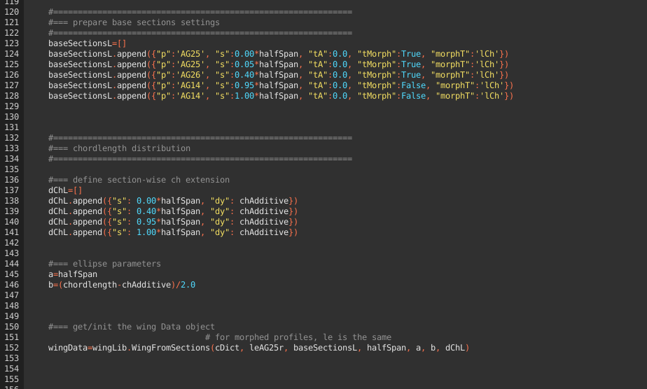](./assets/images/blenderScript10.png)

The rest is as usual and result in the 3D mesh of the wing:
[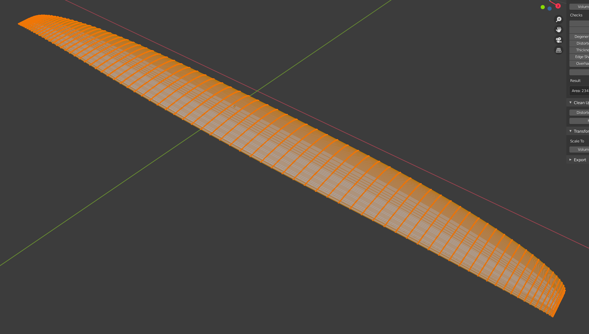](./assets/images/blenderScript11.png)

<br>
##Out & hinge line design, projected area
We'll be using the following files:

|Folder|Name|Comment|
|------|:------|------|
|scripts|wingLib.py|basic worker routines |
|planes/kissSlope|kissSlopeWing.blend|the blender file|
|planes/kissSlope|hingeLine.py|the python script used to generate a sketch of the out- & hinge line|

<br>**hingeLine.py**
This is a simple script generating a beezier curve for the wing outline and a line for the hinge line like the one illustrated below:
[](./assets/images/outlineNew.png)

After the obligatory header and basic geometry definition, l.80ff defines the hinge line, which should be self-explanatory.
[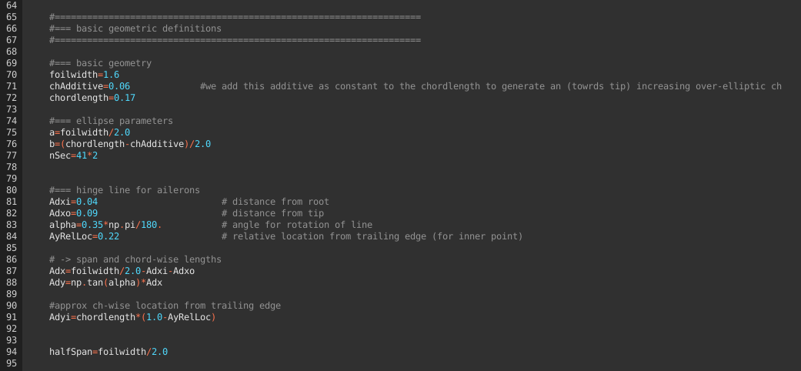](./assets/images/blenderScript13.png)

The following lines then define the section-wise ch extension as dicussed [above](#sectionwisechextension) and plot the curves.

<a name="projectedarea"></a>The **projected area** can now easily be determined via:

- selecting the outline's curve in object mode > object > convert to mesh
- edit mode > select all points (hit a) > face > fill
- object mode > hit n to open the extended dialogue
- select the 4th elemnt in the vertical menue (item - tool - view - 3d print) Should the 3d print menue not show up, check to have preferences > add ons > 3d toolbox checked
- 3d print > hit the area button and find the area in the result field

