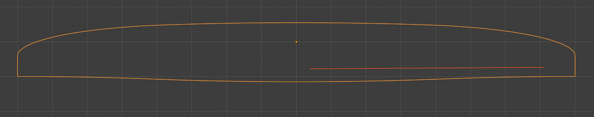
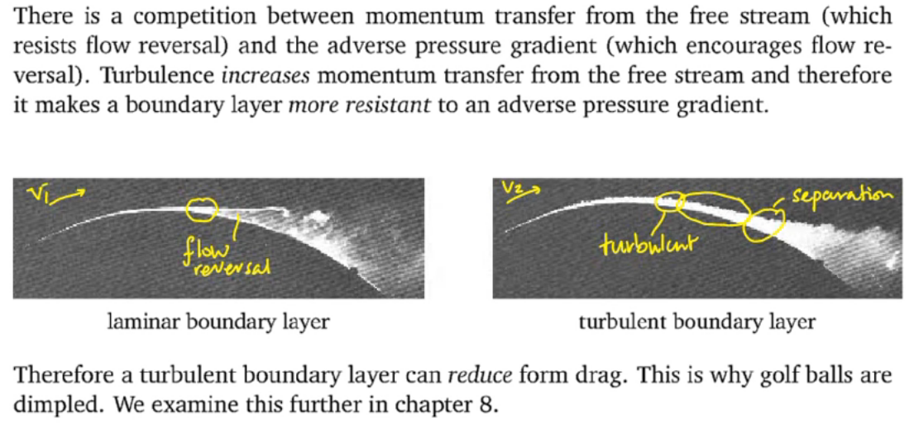
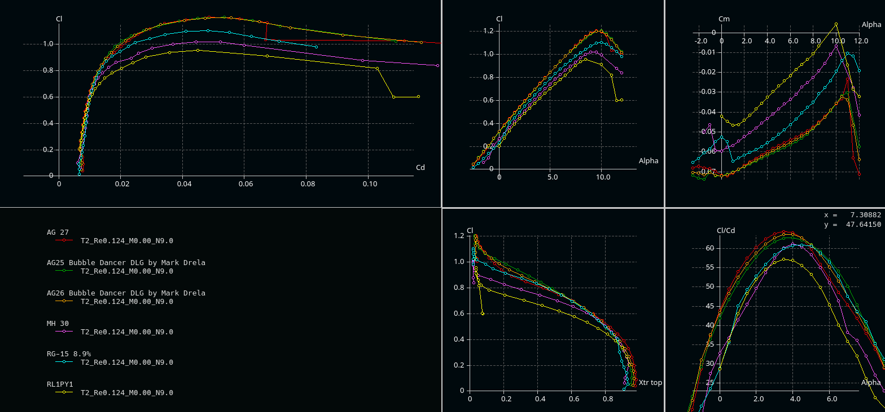
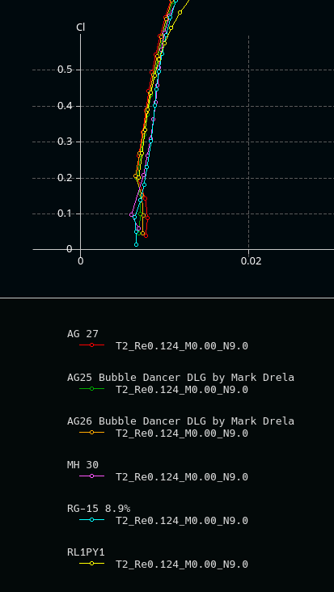

# What is this
This are some early thoughts and design for a simple to build (easy to replace) sailplane for slope soaring. With simple to build I mean simple when you have access to a cnc milling machine for milling foam.

## Wing outline
The outline should be based on the elliptic planar wing basis. Having access to cnc milling, the straight outlines of the Swift or Kobutz are not required.
 We can make use of more organic-like and more efficient (regarding induced drag) shapes like the stingray. You have some spare time? Read [Epplers great paper on induced drag and winglets](https://journals.sfu.ca/ts/index.php/ts/article/download/524/495).

**How do we achieve this?**
 First, we import an image of the said geometry in blender. I used the outline provided at [Rc-Network](https://www.rc-network.de/threads/stingray-profilfrage.173616/) and, as an alternative with a more elliptic shape, also the modster flash, which is also sold as lightning V2.  

Import the image: add > Image > as background and place & scale it.

In the scripting workspace, *kissSlopeWing1.py* should be open. In there, I have the configuration for a more modster-like layout and one with less backwards sweep similar to the stingray.

I personally prefer the upper one (for aesthetic reasons).

**Update:**
 During aerodynamic analysis I opted for a higher aspect ration (1:9.4) and an over-elliptic chordlength towards the outer wing as follows:

In a nutshell: to have the wing root to stall first, we can use a wash-out or over-elliptic chordlength, with over-ellitic chordlenght is more beneficial at higher velocity (see detailed discussion below). 

## Wing loading and Re
### Surface area
For designing the 2d profiles along the wing span (strak, loft), we need to determine the wing loading, and the Reynolds number.

First, we get the (projected) surface in **blender**:
 Edit>preference>add-ons>Mesh: 3d print toolbox - check to have the add-on activated
 **Update:** A simpler alternative to the following is to first sketch the outline as desribed [here](../blenderAirfoils/#projectedarea).

We could now select the wing, hit **N** to pop up the info display (to the right). and select the 4th option (in the right-most menue - tilted by 90°) called *3D Print*, the hit *Area*.
 This gives us the surface area of the wing: 5191.8cm²

But **wait!** this is the total surface, not the 2D projected which we need for equation [basics (1)](../aeroEqn/#mjx-eqn-eq:liftForce1).
 To estimat the 2D projected surface:

- add a cube ob 2m x 1m x 0.0001m and place it at 0/0/0 (it intersects the wing through trailing and leading edge)
- copy the wing
- select the copied wing (myWing1.001 in my case) in object mode
- select the wrench
- select add modifier: boolean
- set to insersect with the plane

- important: apply the modifier; this since 2.8x this is somewhat hidden: hit the triangel right to the camera and select apply (otherwize you will not see the correct mesh in the next step)
- hide myWing1 and Cube
- enter edit mode for myWing1.001

You should see a quite flat mesh (not curved like in the original wing). The 3d Print aera now gives us 5128.7cm².
The projected area is $\frac{1}{2}\cdot 5128.7cm²=\textbf{0.2564m²}$
 **Update:** The updated outline has a projected area of $\textbf{0.2342m²}$ 
 **Note:** this approach will not work when intersecting with a plane (don't ask me why). Therefore, I use a thin cube.

### Weight, minimal velocity an Re

I currently estimate the total weight to 900g and 1300g including some extra ballast (actually 800g, but we need to estimate with a bit of safety margin). For the suface area determined above, this gives a wing loading of 35g/dm² and 51g/dm², respectively.

We can now determine $v$ from [basics (2)](../aeroEqn/#mjx-eqn-eq:velocityFromMass), if we make use of the hypothesis $c_{L}\approx 1.0$. We will cross-check this later!

$v_{min900g}=\sqrt{\frac{2\cdot 0.9kg\cdot 9.81 m/s²}{1.1673kg/m³\cdot 1.0 \cdot 0.2564m²}}=7.68 m/s$

$v_{min1300g}=\sqrt{\frac{2\cdot 1.3kg\cdot 9.81 m/s²}{1.1673kg/m³\cdot 1.0 \cdot 0.2564m²}}=9.23 m/s$

Inserting in [basics (3)](../aeroEqn/#mjx-eqn-eq:reynolds) allows us to plot the Reynolds number over span: 

 for 1300g and 900g

Using xflr5 for analysis [T1: 6:45](../xlfr5GettingStarted/#tutorial-notes) allows us to check our hypothesis $c_{L}\approx 1.0$ from above:

 Click the image to enlarge.
 See the Cl/ALPHA plot (upper mid): for $Re>40.000$ corrsponding to $\sim 93\%$ of the wing span, $c_{l}>1.0$ (note that we use a small index here, as it is a local variable - for the given location).

The inner region (with larger chord) even provides us a safety margin, compensating the decreasing lift at the outer sections of the wing. And this is still the *plain vanilla* MH30_pk profile!

**Resume:** For a plane lighther than 900g, faster than 7.68m/s (lighter than 1300g, faster than 9.23m/s), our hypothesis $c_{L}\not\lt 1.0$ therefore holds with safety margin, which means we can maintain height.
  **But:** Regarding *stability* we would require that flow seperation and hence drop of $c_{l}$ should begin at the inner part of the wing (close to the fuselage) and not from the wingtips.
 Why?
 In the first case, the result will be a plane loosing height (sagging) but still being controllable.
 In the second case, *loosing lift force suddenly at the outer wing region will result in the plane rolling* to that side. Steering against the roll (aileron down, corresponds to an increased angle of attack) makes the situation even worse, because an even larger region is pushed beyond the maximal possible angle of attack $\alpha_{attackMax}$, the angle where breakdown of lift occurs.
  Having a look at the $c_{l}$/APLHA plot shows that (for a given profile) the maximum lift gets lower at an ever smaller angle of attack with decresing Reynolds number. Therefore, without taking means against, this leads to break down of lift starting at the wing tips (because we have smalle $Re$ there).

Means are

- Geometrically decreasig the angle of attack towards wing tips ([twist / washout](https://en.wikipedia.org/wiki/Washout_(aeronautics))), which is inefficient (as the drag increases).
- A better alternative are aerodynamic means: designing and using a profile with adequate $c_{l} / c_{d}$ for the outer wing region,

### Re at normal & speed flight
The considerations above are important for slow flight & high lift situations (thermal climbing, landing, tack).
 However, at normal flight in good conditions, the Re will be much larger. In these situations, it is important to have low $c_D$. To get an impression, I plot Re(span) for slow, medium and high speed normal flight:

## Profiles: preselection

### Basic considerations
There are a plethora of different profiles out there for different purposes. You can find detailed discussions and spend hours reading. **I won't go into depth here** (others have done this; for german readers see e.g. the great work of [Hartmut Siegmann](https://www.aerodesign.de/profile/profile_n.htm); if you know a comparable site in english, please let me know), **but will only document some steps and considerations I have taken**. If you identify mistakes, please let me know!

**First step: collect design ResqrtCl's (actually $Re\sqrt{C_l}$).**

Why? See [ResqrtCl derivation](../aeroEqn/#mjx-eqn-eq:resqrtcl3). At a given wing section (fixed chordlength $ch$), at horicontal flight, this is a constant number. In other words: if *we know the weight* of the plane and *require horicontal flight*, this *determines the flight conditions* ($\alpha$, $Cl$, $Re$).
 This allows us to study e.g. $C_l/C_d$ over the flight states (and e.g. plot it over the resulting $\alpha$).  

As discussed above, the hypothesis of $C_l\approx1.0$ at $v_{min}$ holds. Therefore $Re\sqrt{C_l}\approx Re$.
 We can therefore select some spanwise positions an note $Re\approx Re\sqrt{Cl}\approx const$.
 Typically we choose the following positions:

| |Re @ 0-5% span|Re @ 50% span|Re @ 95% span|
|---:|---:|---:|---:|
|900g|103k|89k|33k|
|1300g|124k|107k|39k|

$Re\approx Re\sqrt{Cl}$ at relative span position for the two considered weights

 

**Robustness or high performance?**

In a nutshell, a profile can not be robust (with respect to how exact can we build, how smooth will the surface be, etc.) and deliver high performance (e.g. max $C_L$ low $C_D$) over a wide range of flight condition at the same time.

If we e.g. go for minimal $C_D$ at a high speed condition, we will *pay* for it in other conditions etc.

For the kissSlope, I decided for robustness (in multiple dimensions). I collected the following list of considerations, conclusion and (where available) link to a related discusion (might be in german, mainly for my own reference): 

| |Consideration|Conclusion|Details|
|---|:---|:---|:---|
|1.|Profiles with long laminar flow get prob. quite bad if we mess it (e.g. geometrically or flight conditions e.g. lower Re at weak conditions)| Try to use a bubble ramp like profile (e.g. the [AG24, 25, 26](http://airfoiltools.com/airfoil/details?airfoil=ag24-il))|We will discuss and illustrate it below. See e.g. the discussion of the [MH30](https://www.aerodesign.de/profile/profile_n.htm#mh30).|
|2.|$C_D$ at low $C_L$ (normal & speed flight) is dominated by parasitic drag from hull, elevator etc.|We will rather go for a reasonably low $C_D$ over a larger range of $C_L$ instead of optimizing for a super low $C_D$ in XFLR5|[Stingray thread](https://www.rc-network.de/threads/stingray-profilfrage.173616/), [Philip Kolb's post](https://www.rc-network.de/threads/stingray-profilfrage.173616/post-2926112)|
|3. |We can not have a profile which is both, optimal for speed (non-bubble ramp) and weak conditions |Probably build 2 sets of wings, or, as I have planes for weak conditions build the heavier one||
|4. |At high lift, the induced drag dominates. | For the kissSlope which is not intended for weak conditions, we will be flying at $C_l<0.6$, and  usual velocities of 15-20 m/s. For landing, higher $C_d$ at high $C_L$ is advantageous. |See my dicussion of the wing outline above, and [Hans Rupp's comments](https://www.rc-network.de/threads/stingray-profilfrage.173616/post-2930382)|
|5. |Minimal sink rate should leave some saftey margin towards stall|Check to have $\alpha_{max}>\alpha_{minSink}+safetyMargin$ |[Hans Rupp's comments](https://www.rc-network.de/threads/stingray-profilfrage.173616/post-2930382)|
|6. |For stability we need the wing root to stall first |The profiles towards (spanwise) wingtip, where we have lower Re should have ${\alpha}_{max}$ larger than at the root.||
|7. |Neutral lift angle of attack should match along span | Check $\alpha_{C_l=0}$ across span|[MHSD discussion](https://www.rc-network.de/threads/neuer-mhsd-profilstrak-f%C3%BCr-mittelgro%C3%9Fe-hang-und-kunstflugsegler-pr%C3%A4sentation.477203/post-477203)|

 
### XFLR5 Results - AGxx or else?
**Discussion to 1.**
 As far as I understood, bubble ramp profiles (Mark Drela's AGxx, SD7003, ...) generate an early laminar -> turbulent transition in the boundary layer. This is not as efficient as profiles which mainatain a longer laminar flow. However, once flow separation occurs, the form of separation my highly influence the resulting drag [(see Martin Hepperle's explanation)](https://www.mh-aerotools.de/airfoils/bubbles.htm).
  See the great explanation by [learnfluidmechanics' video](https://www.youtube.com/watch?v=MvJmppOW2vQ), from which I took the following screenshot (2:30):

Therefore, the *long laminar* profiles might me more efficient at higher Re, at are at rsik to generate larger flow separation bubbles, which then completely messes-up the performance at lower Re.

With this in mind let's see how the AGxx profiles perform in comparison to the other profiles usually referenced (for gliders at higher Re).
For the following (type2) analysis I used the max $Re\sqrt{C_l}=124k$ from the table above (at the wing root for the heavier version), as I expect the effects getting even stronger for lower ResqrtCl.

Solving  [basics (1)](../aeroEqn/#mjx-eqn-eq:liftForce1) for $C_L$ and assume expected normal velocities of 15-25 m/s, we end-up with
$C_{L,900g,15-20m/s}\approx 0.3 - 0.1$
 $C_{L,1300g,15-20m/s}\approx 0.4 - 0.15$ 

Zoomed in $C_L / C_D$ shows: 

Might be that at high velocities, the non bubble-ramp profiles are a bit more efficient.
  However, I'd say for this glider we'd stick with AGxx.