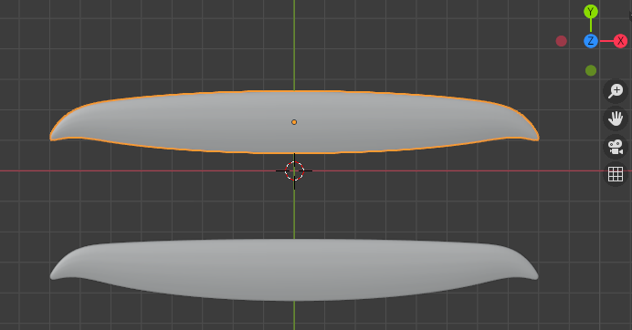

# What is this
This are some early thoughts and design for a simple to build (easy to replace) sailplane for slope soaring. With simple to build I mean simple when you have access to a cnc milling machine for milling foam.


## Wing outline
The outline should be based on the elliptic planar wing basis. Having access to cnc milling, the straight outlines of the Swift or Kobutz are not required.
<br>We can make use of more organic-like and more efficient (regarding induced drag) shapes like the stingray. You have some spare time? Read [Epplers great paper on induced drag and winglets](https://journals.sfu.ca/ts/index.php/ts/article/download/524/495).

**How do we achieve this?**
<br>First, we import an image of the said geometry in blender. I used the outline provided at [Rc-Network](https://www.rc-network.de/threads/stingray-profilfrage.173616/) and, as an alternative with a more elliptic shape, also the modster flash, which is also sold as lightning V2.  

Import the image: add > Image > as background and place & scale it.

In the scripting workspace, *kissSlopeWing1.py* should be open. In there, I have the configuration for a more modster-like layout and one with less backwards sweep similar to the stingray.



I personally prefer the upper one (for aesthetic reasons).

## XLFR5

### Installation

I build the main repo of André (the author of xflr5, aka *techwinder*).
In case of problems you can also try to build the [ubuntu specific patched version](https://github.com/polmes/xflr5-ubuntu).

```
svn checkout https://svn.code.sf.net/p/xflr5/code/trunk xflr5-code
```


Install prerequisites
```
apt-get install build-essential mesa-common-dev mesa-utils libgl1-mesa-dev libglu1-mesa-dev qt5-qmake libqt5opengl5-dev
```


Building
<br>Note: I initially had an error:
> cd xflr5-engine/ && ( test -e Makefile || /usr/lib/qt5/bin/qmake -o Makefile /home/alexp/wicht_soft/xflr5-code/xflr5/xflr5-engine/xflr5-engine.pro ) && make -f Makefile 
> Project ERROR: Unknown module(s) in QT: core gui
> make: *** [Makefile:49: sub-xflr5-engine-make_first] Error 3

Seems to have been fixed by installing libqt5opengl5-dev

```
cd xflr5-code/xflr5
qmake
make
sudo make install
sudo ldconfig
```
Finally, start xlfr5
```
xlfr5
```

### Next


