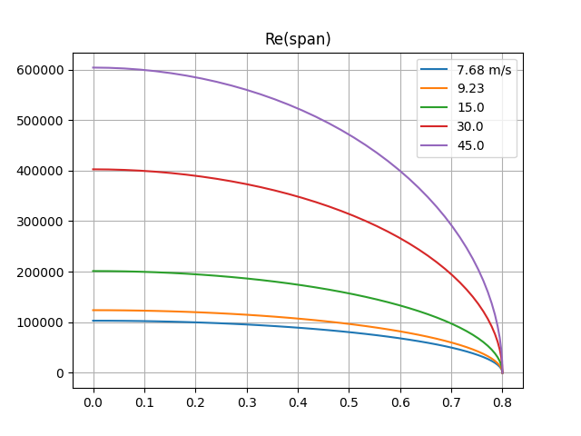

# What is this
This are some early thoughts and design for a simple to build (easy to replace) sailplane for slope soaring. With simple to build I mean simple when you have access to a cnc milling machine for milling foam.

## Wing outline
The outline should be based on the elliptic planar wing basis. Having access to cnc milling, the straight outlines of the Swift or Kobutz are not required.
 We can make use of more organic-like and more efficient (regarding induced drag) shapes like the stingray. You have some spare time? Read [Epplers great paper on induced drag and winglets](https://journals.sfu.ca/ts/index.php/ts/article/download/524/495).

**How do we achieve this?**
 First, we import an image of the said geometry in blender. I used the outline provided at [Rc-Network](https://www.rc-network.de/threads/stingray-profilfrage.173616/) and, as an alternative with a more elliptic shape, also the modster flash, which is also sold as lightning V2.  

Import the image: add > Image > as background and place & scale it.

In the scripting workspace, *kissSlopeWing1.py* should be open. In there, I have the configuration for a more modster-like layout and one with less backwards sweep similar to the stingray.

I personally prefer the upper one (for aesthetic reasons).

## Wing loading and Re
### Surface area
For designing the 2d profiles along the wing span (strak, loft), we need to determine the wing loading, and the Reynolds number.

First, we get the (projected) surface in **blender**:
 Edit>preference>add-ons>Mesh: 3d print toolbox - check to have the add-on activated

We could now select the wing, hit **N** to pop up th info display (to the right). and select the 4th option (in the right-most menue - tilted by 90°) called *3D Print*, the hit *Area*.
 This gives us the surface area of the wing: 5191.8cm²

But **wait!** this is the total surface, not the 2D projected which we need for equation [basics (1)](../aeroEqn/#mjx-eqn-eq:liftForce1).
 To estimat the 2D projected surface:

- add a cube ob 2m x 1m x 0.0001m and place it at 0/0/0 (it intersects the wing through trailing and leading edge)
- copy the wing
- select the copied wing (myWing1.001 in my case) in object mode
- select the wrench
- select add modifier: boolean
- set to insersect with the plane

- important: apply the modifier; this since 2.8x this is somewhat hidden: hit the triangel right to the camera and select apply (otherwize you will not see the correct mesh in the next step)
- hide myWing1 and Cube
- enter edit mode for myWing1.001

You should see a quite flat mesh (not curved like in the original wing). The 3d Print aera now gives us 5128.7cm².
The projected area is $\frac{1}{2}\cdot 5128.7cm²=\textbf{0.2564m²}$
 **Note:** this approach will not work when intersecting with a plane (don't ask me why). Therefore, I use a thin cube.

### Weight, minimal velocity an Re

I currently estimate the total weight to 900g and 1300g including some extra ballast (actually 800g, but we need to estimate with a bit of safety margin).

Togehter with the surface area we can now determine $v$ from [basics (2)](../aeroEqn/#mjx-eqn-eq:velocityFromMass), if we make use of the hypothesis $c_{L}\approx 1.0$. We will cross-check this later!

$v_{min900g}=\sqrt{\frac{2\cdot 0.9kg\cdot 9.81 m/s²}{1.1673kg/m³\cdot 1.0 \cdot 0.2564m²}}=7.68 m/s$

$v_{min1300g}=\sqrt{\frac{2\cdot 1.3kg\cdot 9.81 m/s²}{1.1673kg/m³\cdot 1.0 \cdot 0.2564m²}}=9.23 m/s$

Inserting in [basics (3)](../aeroEqn/#mjx-eqn-eq:reynolds) allows us to plot the Reynolds number over span: 

 for 1300g and 900g

Using xflr5 for analysis [T1: 6:45](../xlfr5GettingStarted/#tutorial-notes) allows us to check our hypothesis $c_{L}\approx 1.0$ from above:

 Click the image to enlarge.
 See the Cl/ALPHA plot (upper mid): for $Re>40.000$ corrsponding to $\sim 93\%$ of the wing span, $c_{l}>1.0$ (note that we use a small index here, as it is a local variable - for the given location).

The inner region (with larger chord) even provides us a safety margin, compensating the decreasing lift at the outer sections of the wing. And this is still the *plain vanilla* MH30_pk profile!

**Resume:** For a plane lighther than 900g, faster than 7.68m/s (lighter than 1300g, faster than 9.23m/s), our hypothesis $c_{L}\not\lt 1.0$ therefore holds with safety margin, which means we can maintain height.
  **But:** Regarding *stability* we would require that flow seperation and hence drop of $c_{l}$ should begin at the inner part of the wing (close to the fuselage) and not from the wingtips.
 Why?
 In the first case, the result will be a plane loosing height (sagging) but still being controllable.
 In the second case, *loosing lift force suddenly at the outer wing region will result in the plane rolling* to that side. Steering against the roll (aileron down, corresponds to an increased angle of attack) makes the situation even worse, because an even larger region is pushed beyond the maximal possible angle of attack $\alpha_{attackMax}$, the angle where breakdown of lift occurs.
  Having a look at the $c_{l}$/APLHA plot shows that (for a given profile) the maximum lift gets lower at an ever smaller angle of attack with decresing Reynolds number. Therefore, without taking means against, this leads to break down of lift starting at the wing tips (because we have smalle $Re$ there).

Means are

- Geometrically decreasig the angle of attack towards wing tips ([twist / washout](https://en.wikipedia.org/wiki/Washout_(aeronautics))), which is inefficient (as the drag increases).
- A better alternative are aerodynamic means: designing and using a profile with adequate $c_{l} / c_{d}$ for the outer wing region,

### Re at normal & speed flight
The considerations above are important for slow flight & high lift situations (thermal climbing, landing, tack).
 However, at normal flight in good conditions, the Re will be much larger. In these situations, it is important to have low $c_D$. To get an impression, I plot Re(span) for slow, medium and high speed normal flight:
