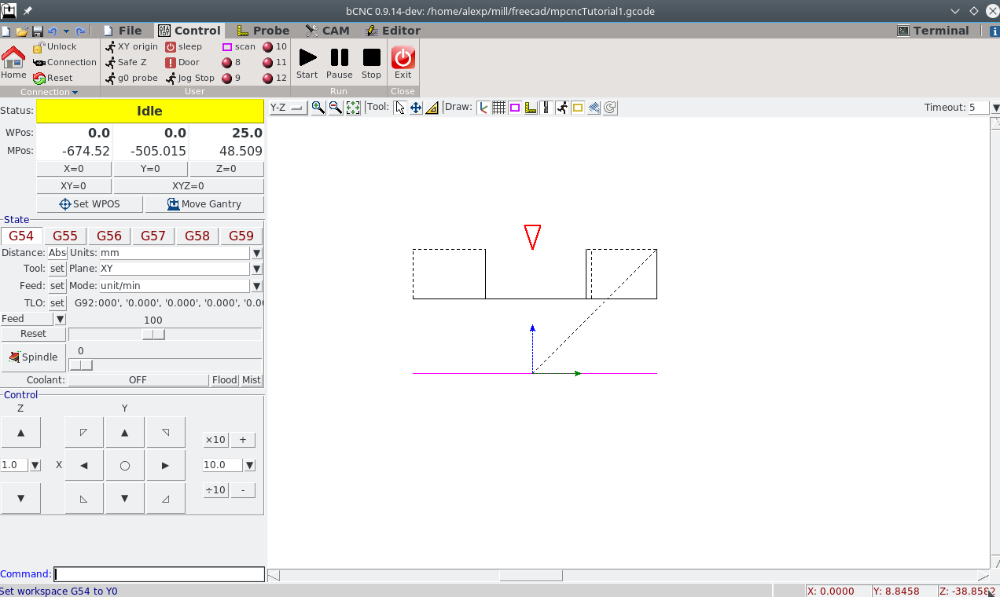
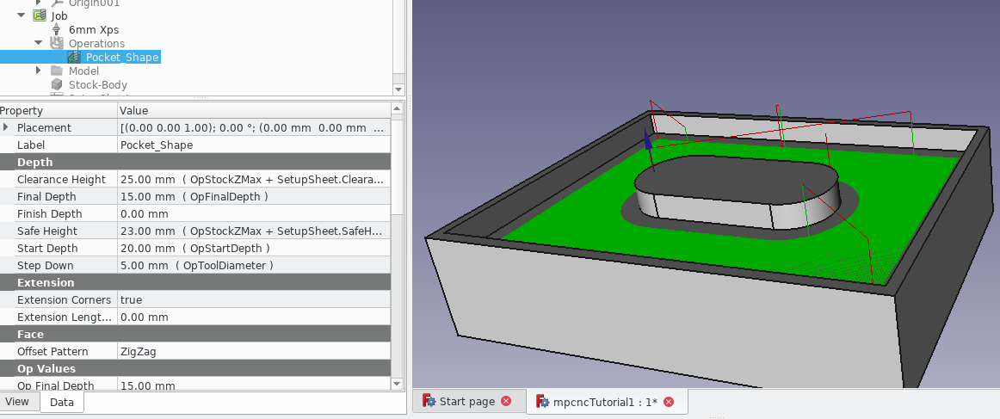
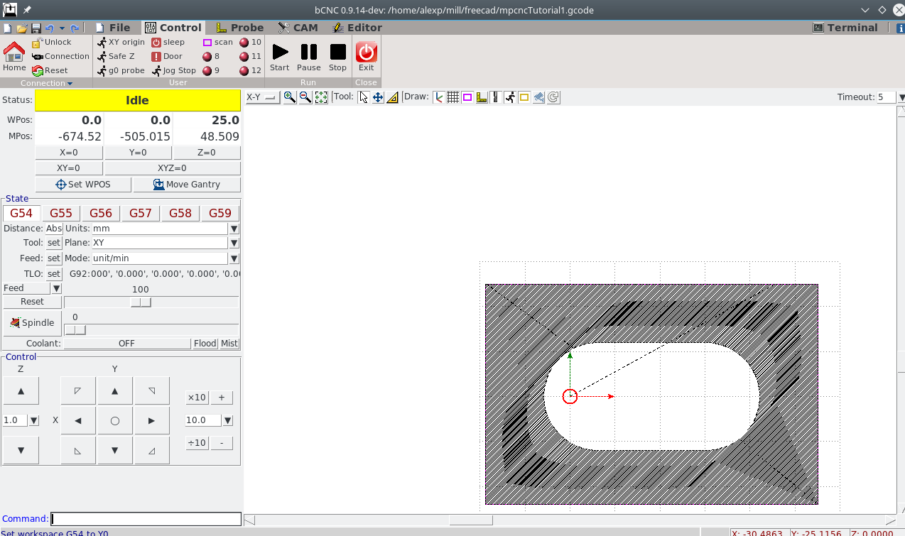
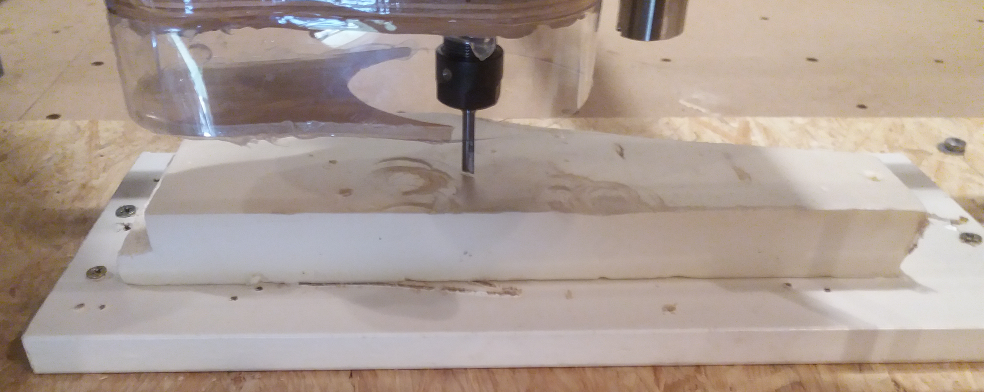

# Import the gcode 

- File>Open the gcode exported in tutorial 1 in bCNC
- In the control tab, you can select the desired view (e.g. x-y and y-z) as shown in the following pictures



The red circle / triagle indicates the position of the machine relative to the workspace position (WPos).

Note that, different from estlcam 2D default, the origin of the path is below the part (as can be seen in the y-z view). Have a look in the gcode to see that we work from positive coordinates down:
- clearance plane at z=+25
- workpiece top z=+20 (freecad's start depth)
- working down to z=+15 (freecad's final depth)
```
Attentive observes will realize in the images and video, that I accidently
used z=+25 (which is the clearence height) instead of z=+20mm, the actual start
height for my milling operation. The follwoing description describes the correct setting.
```
Have a look at the depth settings of the job in FreeCAD, especially *Clearence height*, *Start Depth* and *Final Depth* to crosscheck the correct settings. 



## Position your machine:
- Move your machine and place it relative to the workpiece where you want to have your x/y zero.
- Hit xy=0 in the control window<br> you should now have the red circle in x-y view right on the origin of the path:

<br><br>
- Position the milling cutter right on top of the workpiece. This is the *Start Depth* - in our case z=+20mm 
- Use g92 z 20 to set the machine position accordingly (and not +25 as I did).
- Move up in Z, power on the spindle
- Hit **Start** in the control pane.

The nice thing about grbl is that you can interrupt any command and the machine will (mostly) react instantly - even when e.g. making a long move. Just hit *Pause* or *Stop*. This is different from Marlin, where you only can pause or stop *after* the execution of the current command.

Use the feed slider to slow down or speed up the milling procedure. I applied a speed-up as we used the MDF settings for the milling operation but are milling XPS.

## Possible pitfall - why did I use the wrong z position?
Have a look at the y-z view (the first image). I wrongly interpreted the topmost plane of the path as start depth, which is *wrong*. The path is actually up to clearence plane (z=+25), over to the start position (in x-y) for plunging, fast down to to *start depth*.
So be carefule in interpretation of what you see.


## Machine at work
[](https://www.youtube.com/watch?v=C4NCIReDiNI "Milling part 1")

## Open points
- Add some holding tags
- Ramp or hlical plunge
- Step down in smaller amounts

<br>
Feel free to dicuss your questions in the [related discussion thread](https://www.v1engineering.com/forum/topic/foss-milling-toolchain-freecad-gbrl-on-ramps-discussion/)

