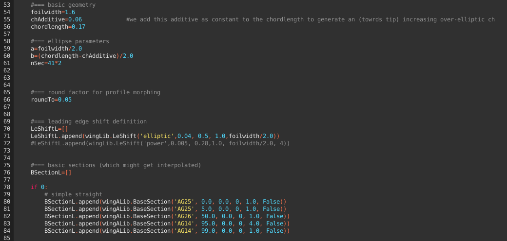
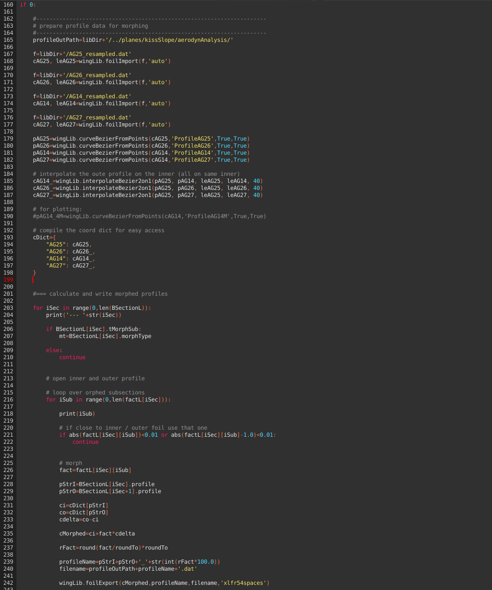
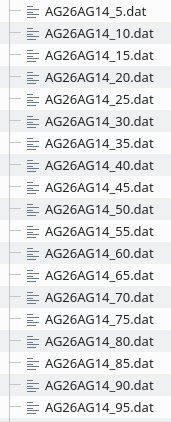
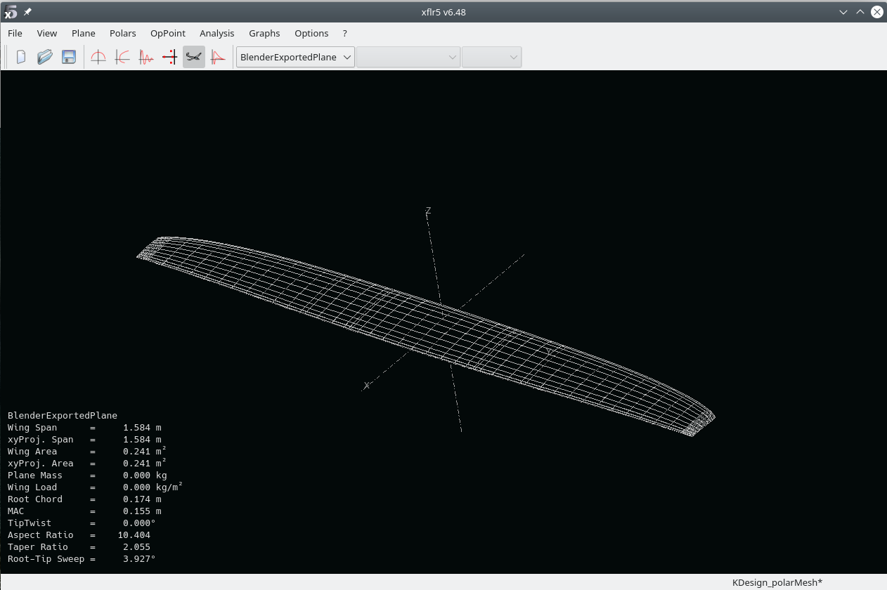
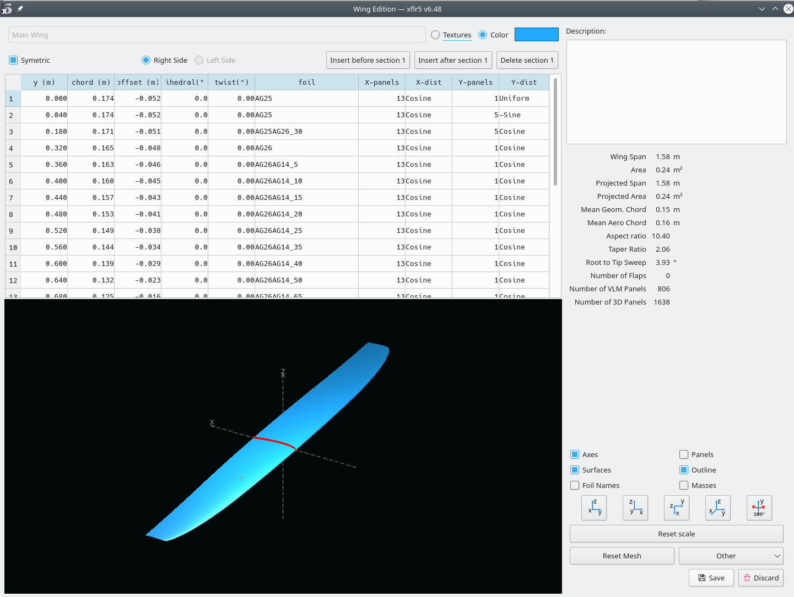
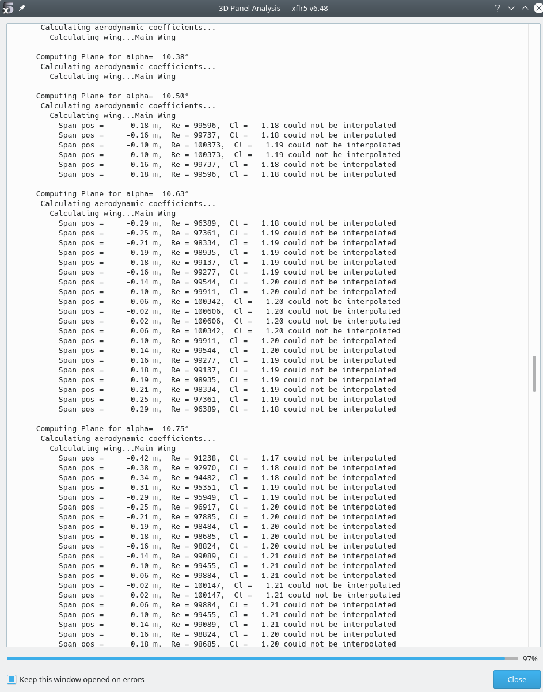
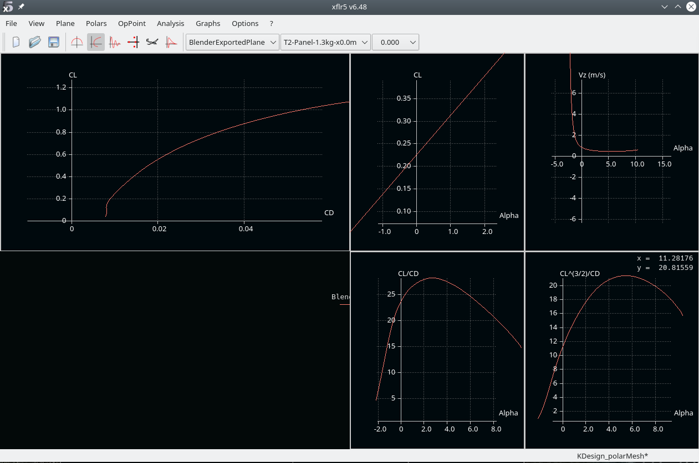
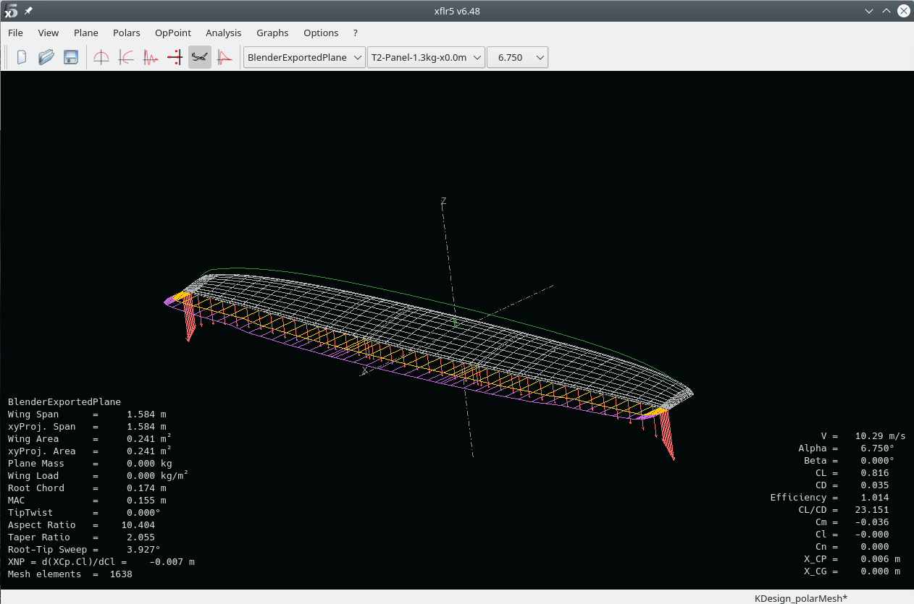

# XLFR5

## Export of complex wing geometries
We'll be using the following files:

|Folder|Name|Comment|
|------|:------|------|
|scripts|wingAnalysisLib.py|basic worker routines for aerodynamics analysis|
|scripts|wingLib.py|basic worker routines |
|planes/kissSlope|kissSlopeWing.blend|the blender file|
|planes/kissSlope|xflr5Analysis.py|the python script used to generate the input for XFLR5 3d analysis|

<br>**xflr5Analysis.py**
Target:

- generate a XFLR5 specific .xml file describing the wing geometry with all its sections
- generate morphed profile data required by XFLR5 to generate whta is called the *foil polar mesh*

Below the obligatory header, we define the basic geometric data, the leading edge shift as well as the base sections as discussed in [more complex wing design](../blenderAirfoils#more-complex-wing-design).

[](./assets/images/blenderScript14.png)

<br>The magic the happens in L.131 - generating the xml sceletton required for XFLR5, adding the subsections according to the definition (l. 132) and writing the xml file (l.137ff):

[](./assets/images/blenderScript15.png)

<br>
## Generating morphed profil data
The wing geometry we defined above makes use of morphed profiles for the subsections.
For the XFLR5 3D analysis, we need the related 2D profil data to generate what is called the *foil polar mesh*. Please have a look at André's [tutorial No6](https://www.youtube.com/watch?v=QfGSKCrv-Ps&list=PLtl5ylS6jdP6uOxzSJKPnUsvMbkmalfKg&index=7) and [docs](http://www.xflr5.tech/docs/Point_Out_Of_Flight_Envelope.pdf) for details. 

The attentive reader might already have spotted l.66: ```roundTo=0.05```.
This setting is used to reduce the necessary amount of profile data required. A setting of 0.05 means that we use 5% steps for the morphed profiles. The local profile along the subsections use the next available profile along this 5% grid.
<br>Execute l.160ff once to generate all the required profile data files in the directory configured in l.165.

[](./assets/images/blenderScript16.png)

The result for the AG26 <-> AG14 morph is:<br> 
[](./assets/images/blenderScript17.png)

## Foil polar mesh

- start XFLR5 in
- switch to xfoil direct analysis
- file > open > select all the written .dat files
- analysis > multi threaded batch analysis
- select all profiles (and the unmorphed ones, in our case AG25, AG26, and AG14)
- define a sensible Re range
- run the batch analysis (this will take a while)

After the analysis finished

- select each profile in the drop down menue
- hit crtl+u and control the quality of each polar
- correct if necessary (for the AGxx, I sometimes needed to delete points at $\alpha=-2.5°$ and re-calculate with finer angualr steps for $\alpha>0$  for some polars

I added the resulting XFLR5 file (for the kissSlope wing analyis) on github as [KDesign_polarMesh.xfl](https://github.com/alexpGH/blenderCadCamTools/blob/main/planes/xflr5/KDesign_polarMesh.xfl).


## Import the wing for 3d analyis
 - start XFLR5
 - open the KDesign_polarMesh.xfl - or generate your own polar for the required Re range
 - file > wing and plane design
 - plane > import plane from xml file

Should display the wing:

[](./assets/images/blenderScript18.png)

- plane > current plane > edit wing
Should display all the defined sections:


[](./assets/images/blenderScript19.png)


Next:

- analysis > define analysis
- select type2
- on tab *inertia* set the palne mass (for the kissSlope 0.9 or 1.3kg) > save
- in the plane analysis window set the angular region > hit analyze

<a name="logout"></a>The log output provides interesting information:
In my case the analysis had errors, namely at higher $alpha$. This is where separation occurs and XFLR5 can not find the related operating point in the 2D data:
[](./assets/images/blenderScript20.png)

This tells us that starting from $\alpha=10.5°$, separation occurs, luckily from the root region (small span pos values), with the separation growing for increasing $alpha$.

- hit close

and have a look at the polars
[](./assets/images/blenderScript20.png)

the 3D visualization

[](./assets/images/blenderScript20.png)

and all the other stuff.

See André's [tutorials](https://www.youtube.com/playlist?list=PLtl5ylS6jdP6uOxzSJKPnUsvMbkmalfKg) for more details, especially No 8.
